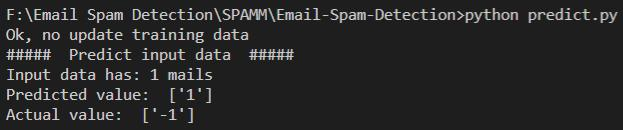
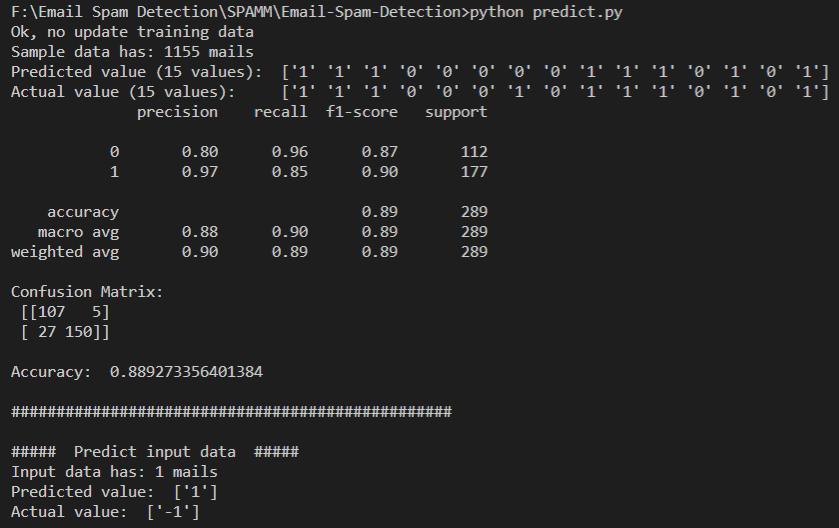
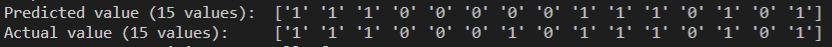

# Email Spam Detection
 Predict your emails are spam or not using Bayes algorithm (supporting Vietnamese.)
 <br />
 
<!-- TABLE OF CONTENTS -->
## Table of Contents
* [About the Project](#about-the-project)
* [Getting Started](#getting-started)
  * [Requirement](#requirement)
  * [Installation](#installation)
* [Usage](#usage)
  * [Training data](#training-data)
  * [Test data](#test-data)
  * [Statistic](#statistic)
* [Reference](#reference)
<br />

<!-- ABOUT THE PROJECT -->
## About The Project <a name="about-the-project"></a>
  <a></a>
- This project is used to predict the emails spam or not (supporting Vietnamese.) <br />
- `Preprocessing step`: Filter `stopwords` (`vi` and `eng`) to get value keywords and save to files.
- Because of saving to files after `preprocessing step`, it don't take too much time to preprocess for each training model times.
<br />


<!-- GETTING STARTED -->
## Getting Started <a name="getting-started"></a>
- To get a local copy up and running follow these simple steps.

### Requirement <a name="requirement"></a>
- All versions `Python 3.x` are compatible with this project.

### Installation <a name="installation"></a>
- Clone the repo
```sh
git clone https://github.com/nunuthuan99/Email-Spam-Detection
```
<br />


## Usage <a name="usage"></a>
### Training data <a name="training-data"></a>
1. Paste your training data (file `.txt` or `.mbox`) in these folders `data/inputRawSpamMails` and `data/inputRawHamMails` respectively your `spam email` and your `ham email`
2. For runing in the first time, make sure `updateSampleFiles` attribute in file `predict.py` is set to `True`
```sh
updateSampleFiles = True
```
### Test data <a name="test-data"></a>
1. Paste your test data (file `.txt` or `.mbox`) in the folder `data/test`
2. Run this code in your command to predict the emails are spam or not.
```sh
python predict.py
```
- After running, your testing and training data will preprocess and be saved to files `.txt` in the folders `data/preprocessingSpamMails`, `data/preprocessingHamMails` and `data/output` respectively your training input `spam email`, your `ham email` and testing `output`
- Thus, after the first time running, the data which is preprocessed is saved to files. So, you no longer preprocess your `training data` to predict the emails for the next times except for your updating some `training data`
- To disable processing training data, set `updateSampleFiles` attribute in file `predict.py` is set to `False`
```sh
updateSampleFiles = False
```
- The result will look like this: <br />
  <a>
    
  </a>

### Statistic <a name="statistic"></a>
- If you want to see details (precision, accuracy,...) about training model, set `show_acc_sample_data` attribute in file `predict.py` to `True`
```sh
show_acc_sample_data = False
```
- And the output looks like this: <br />
  <a>
    
  </a>

* Let's explain some infomation about the output:
  * As the result, we see the amount of training data are `1155 mails` (include ham/spam mails.)
  * `test_size = 0.25`. It means we split randomly 25% in `1155 mails` to test, the others are for training.
  * `test_size` can be changed in file `processmodel.py`:
  ```sh
    def processingModel(acc_score_of_sample_data=True):
    df_train = readfileinput.get_df_train()
    if acc_score_of_sample_data:  # print some predict values and show accuracy of sample data
        messages_bow = CountVectorizer(analyzer=readfileinput.seperate_msg).fit_transform(df_train['messages'])
        X_train, X_test, y_train, y_test = train_test_split(messages_bow, df_train['spam'], test_size=0.25, shuffle=True)
        classifier = MultinomialNB()
        classifier.fit(X_train, y_train)
    ...
  ```
  *  Check randomly 15 emails by Bayes algorithm. Value `1` is `spam`, the other is `ham`
  <a></a>
  * The next lines are information about `Confusion Matrix`
  * The last lines are to predict your test input data.
<br />


<!-- Reference -->
## Reference <a name="reference"></a>
[Email Spam Detection Using Python & Machine Learning](https://medium.com/@randerson112358/email-spam-detection-using-python-machine-learning-abe38c889855)<br />
[Lý thuyết về mạng Bayes và ứng dụng vào bài toán lọc thư rác](https://viblo.asia/p/ly-thuyet-ve-mang-bayes-va-ung-dung-vao-bai-toan-loc-thu-rac-07LKXzkelV4)<br />
[Vietnamese Stopwords](https://github.com/stopwords/vietnamese-stopwords)<br />