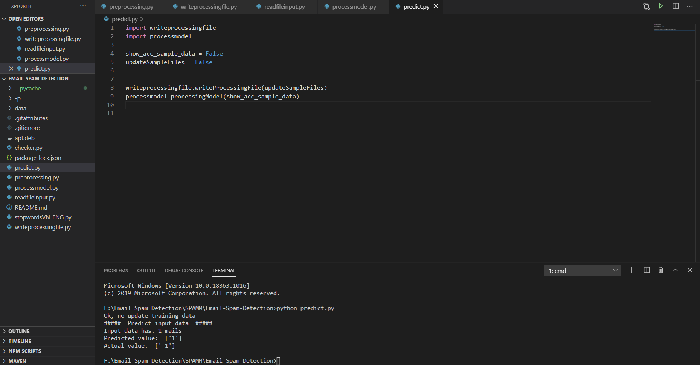

# Email Spam Detection
 Email Spam Detection (support Vietnamese) using Bayes.

### `python predict.py`
type it on terminal to run codes.<br />

<b>`Input:`</b> paste your data (one or some mails) to <b><i>data/test</i></b> folder. <br />
<em>Format input:</em> file <b><i>'.mbox'</i></b>: not decoded, file <b><i>'.txt'</i></b>: decoded. <br />
(see <b><i>data/test</i></b> folder for more details.)<br />
<b>`Output:`</b> print on your console a list of your mails is spam or not.<br />
<br />

## Reference
[Email Spam Detection Using Python & Machine Learning](https://medium.com/@randerson112358/email-spam-detection-using-python-machine-learning-abe38c889855)<br />
[Lý thuyết về mạng Bayes và ứng dụng vào bài toán lọc thư rác](https://viblo.asia/p/ly-thuyet-ve-mang-bayes-va-ung-dung-vao-bai-toan-loc-thu-rac-07LKXzkelV4)<br />
[Vietnamese Stopwords](https://github.com/stopwords/vietnamese-stopwords)<br />

 
<!-- TABLE OF CONTENTS -->
## Table of Contents

* [About the Project](#about-the-project)
  * [Built With](#built-with)
* [Getting Started](#getting-started)
  * [Prerequisites](#prerequisites)
  * [Installation](#installation)
* [Usage](#usage)
* [Roadmap](#roadmap)
* [Contributing](#contributing)
* [License](#license)
* [Contact](#contact)
* [Acknowledgements](#acknowledgements)


<!-- ABOUT THE PROJECT -->
## About The Project

  <a>
    
  </a>

This project is used to detect the emails spam or not (supporting Vietnamese.)


<!-- GETTING STARTED -->
## Getting Started
- To get a local copy up and running follow these simple steps.

### Requirement
- All versions `Python 3.x` are compatible with this project.

### Installation
- Clone the repo
```sh
git clone https://github.com/nunuthuan99/Email-Spam-Detection
```

## Usage
### Training data
1. Paste your training data (file `.txt` or `.mbox`) in these folders `data/inputRawSpamMails` and `data/inputRawHamMails` respectively your `spam email` and your `ham email`
2. For runing in the first time, make sure `updateSampleFiles` attribute in file `predict.py` is set to `True`
```sh
updateSampleFiles = True
```
### Test data
1. Paste your test data (file `.txt` or `.mbox`) in the folder `data/test`
2. Run this code in your command to predict the emails are spam or not.
```sh
python predict.py
```
- After running, your testing and training data will preprocess and be saved to files `.txt` in the folders `data/preprocessingSpamMails`, `data/preprocessingHamMails` and `data/output` respectively your training input `spam email`, your `ham email` and testing `output`
- Thus, after the first time running, the data which is preprocessed is saved to files. So, you no longer preprocess your `training data` to predict the emails for the next times except for your updating some `training data`
- To disable processing training data, set `updateSampleFiles` attribute in file `predict.py` is set to `False`
```sh
updateSampleFiles = False
```
- The result will look like this:
  <a>
    
  </a>

### Statistic
- If you want to see details (precision, accuracy,...) about training model, set `show_acc_sample_data` attribute in file `predict.py` to `True`
```sh
show_acc_sample_data = False
```
- And the output looks like this: 
  <a>
    
  </a>
- - As the result, we see the amount of training data are `1155 mails` (include ham/spam mails.)


<!-- CONTRIBUTING -->
## Contributing

Contributions are what make the open source community such an amazing place to be learn, inspire, and create. Any contributions you make are **greatly appreciated**.

1. Fork the Project
2. Create your Feature Branch (`git checkout -b feature/AmazingFeature`)
3. Commit your Changes (`git commit -m 'Add some AmazingFeature'`)
4. Push to the Branch (`git push origin feature/AmazingFeature`)
5. Open a Pull Request


<!-- LICENSE -->
## License

Distributed under the MIT License. See `LICENSE` for more information.


<!-- CONTACT -->
## Contact

Your Name - [@twitter_handle](https://twitter.com/twitter_handle) - email

Project Link: [https://github.com/github_username/repo](https://github.com/github_username/repo)


<!-- ACKNOWLEDGEMENTS -->
## Acknowledgements

* []()
* []()
* []()


<!-- MARKDOWN LINKS & IMAGES -->
<!-- https://www.markdownguide.org/basic-syntax/#reference-style-links -->
[contributors-shield]: https://img.shields.io/github/contributors/othneildrew/Best-README-Template.svg?style=flat-square
[contributors-url]: https://github.com/othneildrew/Best-README-Template/graphs/contributors
[forks-shield]: https://img.shields.io/github/forks/othneildrew/Best-README-Template.svg?style=flat-square
[forks-url]: https://github.com/othneildrew/Best-README-Template/network/members
[stars-shield]: https://img.shields.io/github/stars/othneildrew/Best-README-Template.svg?style=flat-square
[stars-url]: https://github.com/othneildrew/Best-README-Template/stargazers
[issues-shield]: https://img.shields.io/github/issues/othneildrew/Best-README-Template.svg?style=flat-square
[issues-url]: https://github.com/othneildrew/Best-README-Template/issues
[license-shield]: https://img.shields.io/github/license/othneildrew/Best-README-Template.svg?style=flat-square
[license-url]: https://github.com/othneildrew/Best-README-Template/blob/master/LICENSE.txt
[linkedin-shield]: https://img.shields.io/badge/-LinkedIn-black.svg?style=flat-square&logo=linkedin&colorB=555
[linkedin-url]: https://linkedin.com/in/othneildrew
[product-screenshot]: images/screenshot.png
